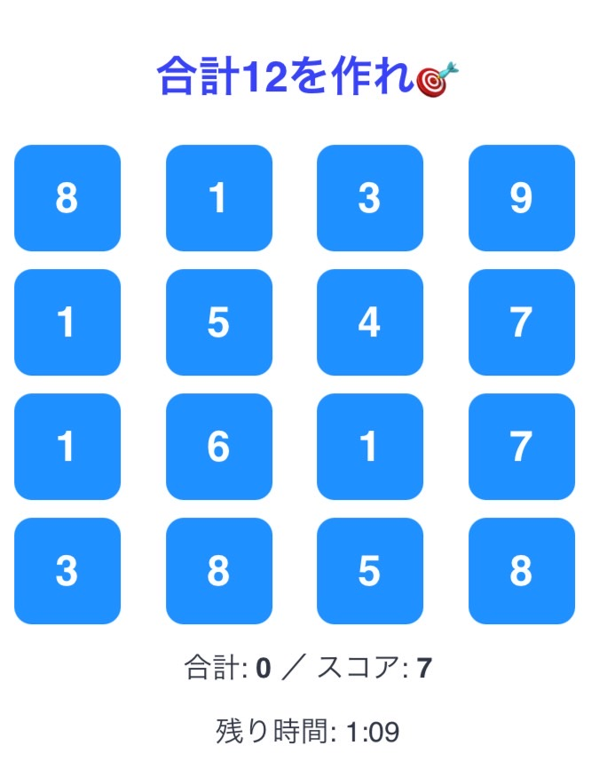

### 🔢 Make 12 by Connecting the Tiles!

Try this casual sliding puzzle game where your goal is simple:  
**connect adjacent tiles to make a total of 12**!  
Swipe, match, and clear — it’s easy to pick up, but surprisingly satisfying 😎

▶️ [**Play Now**](https://20-lake.vercel.app/)

---

## ⚛️ React + Vite

This project is built with **React + Vite**, offering a minimal and fast setup with Hot Module Replacement (HMR) and linting support.

Currently, two official plugins are available:

- [`@vitejs/plugin-react`](https://github.com/vitejs/vite-plugin-react): Uses Babel for Fast Refresh
- [`@vitejs/plugin-react-swc`](https://github.com/vitejs/vite-plugin-react-swc): Uses SWC for Fast Refresh

---

## 🧹 Expanding the ESLint Configuration

For production-ready development, it's recommended to use **TypeScript** with **type-aware ESLint rules**.

To get started:
- Add `typescript`
- Add [`typescript-eslint`](https://typescript-eslint.io)

Check out the [official TypeScript template](https://github.com/vitejs/vite/tree/main/packages/create-vite/template-react-ts) to see how to set it up.

---

📌 Feedback or bug reports? Feel free to open an issue or PR. Contributions welcome!
